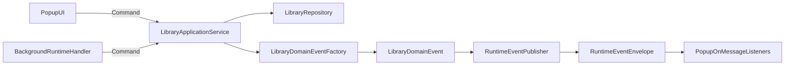

# DDD Domain Event Messaging Refactor

## Objective

Standardize entity-originated events and runtime message contracts so the repo can evolve toward event-driven behavior without a breaking rewrite.

## Confirmed Scope Decisions

- Migration mode: **incremental and backward compatible**.
- Event production boundary: **application service/use-case layer** (not repository internals, not UI/background manual emission).

## Current Insertion Points (Where to Refactor)

- Message contracts and guards are centralized in `[extension/src/lib/library/messages.ts](extension/src/lib/library/messages.ts)` but currently mix command messages and domain-ish update events.
- Entity state changes happen in `[extension/src/lib/library/repository.ts](extension/src/lib/library/repository.ts)` (`createCollection`, `updateCollection`, `deleteCollection`, `saveComponent`, `moveComponent`, `deleteComponent`).
- Runtime command handling is in `[extension/src/background.ts](extension/src/background.ts)` (`chrome.runtime.onMessage.addListener`).
- UI-side mutation commands and manual `LIBRARY_UPDATED` emissions are in `[extension/src/popup/App.tsx](extension/src/popup/App.tsx)`.
- Capture command send is in `[extension/src/popup/lib/messages.ts](extension/src/popup/lib/messages.ts)`.
- Content script has duplicated message types in `[extension/src/content.ts](extension/src/content.ts)`.
- Dev runtime shim mirrors message behavior in `[extension/src/popup/dev/chrome-shim.ts](extension/src/popup/dev/chrome-shim.ts)`.
- Duplicate popup-only capture types exist in `[extension/src/popup/types.ts](extension/src/popup/types.ts)`.

## Target Architecture (DDD + Transport Separation)

## Refactor Plan

### Phase 1: Introduce canonical event kernel and split contracts

1. Add a shared domain event base in a new file: `[extension/src/lib/events/domain-event.ts](extension/src/lib/events/domain-event.ts)`.
  - Define `DomainEvent` base shape with `eventId`, `occurredAt`, `eventName`, `aggregateType`, `aggregateId`, `version`, and `payload`.
  - Keep dependency-free (no new libraries).
2. Add library bounded-context event union in a new file: `[extension/src/lib/library/domain-events.ts](extension/src/lib/library/domain-events.ts)`.
  - Define explicit event types for: collection created/updated/deleted, component saved/moved/deleted.
  - Include event factory helpers to keep event construction consistent.
3. Refactor `[extension/src/lib/library/messages.ts](extension/src/lib/library/messages.ts)` into transport-only contracts.
  - Keep command messages (`START_CAPTURE`, `SAVE_COMPONENT`) and runtime envelope guards.
  - Introduce a typed runtime event envelope for library notifications.
  - Preserve existing exports as compatibility aliases for an initial migration window.

### Phase 2: Move event production to application service layer

1. Add `[extension/src/lib/library/application-service.ts](extension/src/lib/library/application-service.ts)`.
  - Wrap repository mutations and emit domain events from use cases.
  - Return mutation result + emitted domain events (or publish internally through a provided publisher interface).
2. Add publisher port + runtime adapter:
  - `[extension/src/lib/events/event-publisher.ts](extension/src/lib/events/event-publisher.ts)` (interface)
  - `[extension/src/lib/events/chrome-runtime-event-publisher.ts](extension/src/lib/events/chrome-runtime-event-publisher.ts)` (adapter)
3. Keep `[extension/src/lib/library/repository.ts](extension/src/lib/library/repository.ts)` focused on persistence/invariants only.
  - No direct messaging in repository.
  - Optional small return-shape adjustments only if needed by application service.

### Phase 3: Migrate runtime handlers and popup commands

1. Refactor `[extension/src/background.ts](extension/src/background.ts)`:
  - Keep command ingress (`onMessage`) but route persistence mutations through `LibraryApplicationService`.
  - Replace ad-hoc `notifyLibraryUpdated` calls with domain-event publication via publisher adapter.
2. Refactor `[extension/src/popup/App.tsx](extension/src/popup/App.tsx)`:
  - Replace direct repository mutation + manual `LIBRARY_UPDATED` send with application-service calls.
  - Keep UI listener behavior but consume the new runtime event envelope/guards.
3. Refactor `[extension/src/popup/lib/messages.ts](extension/src/popup/lib/messages.ts)`:
  - Keep command API, align response typing to the transport contract module.

### Phase 4: Remove type drift and finalize compatibility

1. Remove duplicate message types from `[extension/src/content.ts](extension/src/content.ts)`.
  - Use `import type` from canonical transport contracts to avoid runtime module coupling.
2. Remove popup-duplicate capture types from `[extension/src/popup/types.ts](extension/src/popup/types.ts)` and keep only truly popup-local types/constants.
3. Update `[extension/src/popup/dev/chrome-shim.ts](extension/src/popup/dev/chrome-shim.ts)` to support the new event envelope shape while preserving old message behavior during transition.
4. After all call sites migrate, deprecate and remove compatibility aliases from `[extension/src/lib/library/messages.ts](extension/src/lib/library/messages.ts)`.

### Phase 5: Repository-wide rollout safeguards

1. Add an eventing reference doc: `[docs/architecture/domain-events.md](docs/architecture/domain-events.md)`.
  - Event naming convention (`library.collection.created.v1`, etc.).
  - Difference between commands and domain events.
  - Mapping from domain events to runtime envelopes.
2. Verify all call sites with repo-wide search:
  - Legacy literals: `"LIBRARY_UPDATED"`, `"START_CAPTURE"`, `"SAVE_COMPONENT"`.
  - Legacy payload key patterns that bypass canonical factories.
3. Run full verification gates:
  - `bun run typecheck`
  - `bun run build`

## Migration Notes and Risk Controls

- Keep runtime compatibility in early phases: old and new envelope shapes can be accepted by guards during migration.
- Keep repository API stable where possible; perform behavior changes in service layer to reduce side effects.
- Sequence changes by boundary: contracts -> service -> runtime handlers -> UI -> cleanup.
- Do not introduce event sourcing or persistent outbox yet; this plan only standardizes contracts and event production boundaries.

## Acceptance Criteria

- Every library state mutation emits a typed domain event via the application service.
- No UI/background code manually crafts ad-hoc event payloads.
- Command contracts and event contracts are separated and canonical.
- `content.ts` and popup no longer own duplicate message type definitions.
- Repo builds and typechecks successfully with only canonical message/event contracts in use.

